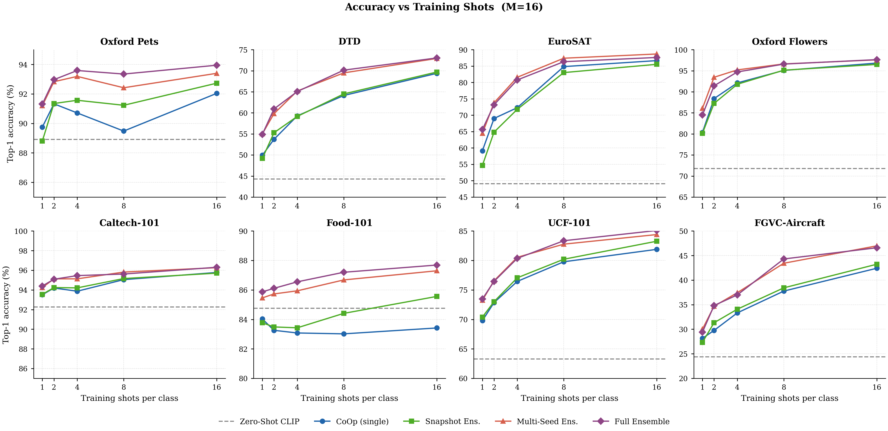

# Prompt Tuning of Vision-Language Models with CLIP

[](https://github.com/mohammadabdalaziz241/clip-coop-prompt-learning/actions/workflows/python-checks.yml)

[Results](#key-results) · [Run one experiment](#running-an-experiment) · [Ensembles](#evaluating-ensembles-and-model-soups) · [My contribution](#academic-context)

Few-shot image classification using **Context Optimization (CoOp)** with a frozen CLIP ViT-B/16 backbone.

This repository contains my implementation and experimental analysis of CoOp prompt learning across eight image-classification benchmarks. The study examines how labelled-data availability, prompt context length, random initialization, checkpoint ensembling, and weight-space Model Soups affect downstream performance.

<p align="center">
  
</p>

<p align="center">
  <em>Few-shot CoOp performance across eight datasets using 16 learnable context tokens.</em>
</p>

## Overview

CLIP performs zero-shot image classification by comparing image embeddings with text embeddings generated from natural-language prompts. Its downstream performance, however, can be sensitive to prompt wording.

CoOp replaces manually designed prompt context with learnable continuous vectors:

```text
[V1] [V2] ... [VM] [CLASS]
```

During training:

* The CLIP image encoder remains frozen.
* The CLIP text encoder remains frozen.
* Only the continuous context vectors are optimized.
* Few-shot subsets are sampled independently for every class.
* Performance is evaluated using top-1 accuracy and macro-F1.

## Key Results

Average performance across the eight datasets at **16 shots** and **M = 16**:

| Method                  | Average accuracy |
| ----------------------- | ---------------: |
| Zero-shot CLIP          |           64.86% |
| CoOp, best single seed  |           81.06% |
| Snapshot Ensemble       |           81.53% |
| Multi-Seed Ensemble     |           83.45% |
| Full Ensemble           |       **83.50%** |
| Uniform Model Soup      |           54.05% |
| Greedy Model Soup       |           80.92% |
| Full Uniform Model Soup |           64.21% |

The Full Ensemble improves average accuracy by **2.44 percentage points** over the best single-seed CoOp result.

The results show that logit-space ensembling is considerably more reliable than directly averaging independently optimized prompt vectors. Uniform Model Soups can collapse because separate training runs may converge to incompatible locations in the learned prompt space.

## Experimental Design

The complete experiment includes:

* **8 datasets**
* **5 shot counts:** 1, 2, 4, 8, and 16
* **3 context lengths:** 4, 8, and 16 tokens
* **3 random seeds:** 1, 2, and 3
* **360 training configurations**
* Multiple saved checkpoints for snapshot ensembling

### Datasets

* Oxford-IIIT Pets
* Describable Textures Dataset
* EuroSAT
* Oxford Flowers-102
* Food-101
* Caltech-101
* UCF-101
* FGVC-Aircraft

## Ensemble and Model-Soup Strategies

The evaluation pipeline compares:

* **Best-seed CoOp:** the strongest final checkpoint across seeds
* **Mean CoOp:** average single-model performance across seeds
* **Snapshot Ensemble:** averages logits from checkpoints along a training trajectory
* **Multi-Seed Ensemble:** averages final-model logits across seeds
* **Full Ensemble:** averages logits across seeds and snapshots
* **Uniform Soup:** averages final prompt weights across seeds
* **Greedy Soup:** validation-guided prompt-weight averaging
* **Full Uniform Soup:** averages prompt weights across all seeds and snapshots

## Repository Structure

```text
clip-coop-prompt-learning/
├── plots/
│   ├── accuracy_vs_shots/
│   ├── cross_dataset/
│   └── embeddings/
├── results/
│   ├── coop_all_results.md
│   ├── ensemble_results.md
│   └── summary_results.csv
├── src/
│   ├── config.py
│   ├── coop_evaluate.py
│   ├── coop_model.py
│   ├── coop_train.py
│   ├── datasets.py
│   ├── prompts.py
│   ├── visualize_embeddings.py
│   └── visualize_results.py
├── .gitignore
├── requirements.txt
└── README.md
```

## Installation

Clone the repository and create a virtual environment:

```bash
git clone https://github.com/mohammadabdalaziz241/clip-coop-prompt-learning.git
cd clip-coop-prompt-learning

python3 -m venv .venv
source .venv/bin/activate

pip install --upgrade pip
pip install -r requirements.txt
```

The project installs OpenAI CLIP directly from its GitHub repository.

## Validation

The [Python checks workflow](.github/workflows/python-checks.yml) compiles the source files on each push and pull request. Run the same syntax check locally:

```bash
python -m compileall -q src
```

This check validates Python syntax. It does not reproduce model accuracy or replace a training run; those require the datasets and checkpoints described below.

## Dataset Setup

Datasets are not included in this repository.

By default, the code expects them under:

```text
data/
├── oxford_pets/
├── dtd/
├── eurosat/
├── oxford_flowers/
├── food-101/
├── caltech-101/
├── ucf101/
└── fgvc-aircraft-2013b/
```

Each dataset directory should contain the dataset images and its corresponding Zhou split JSON file.

A different dataset location can be supplied using the `COOP_DATA_ROOT` environment variable:

```bash
export COOP_DATA_ROOT="/path/to/datasets"
```

## Running an Experiment

Run one CoOp configuration:

```bash
python src/coop_train.py \
  --dataset dtd \
  --seed 1 \
  --shot 16 \
  --ctx 16
```

Supported dataset identifiers:

```text
oxford_pets
dtd
eurosat
oxford_flowers
food101
caltech101
ucf101
fgvc_aircraft
```

Omitting an argument runs every available value for that dimension. Running the script without arguments launches the complete experimental grid and may require substantial computation and storage.

## Evaluating Ensembles and Model Soups

After training checkpoints have been generated:

```bash
python src/coop_evaluate.py
```

The script writes the evaluation results to:

```text
results/coop/ensemble/ensemble_results.csv
```

## Generating Figures

Generate the cross-dataset result figures:

```bash
python src/visualize_results.py
```

Generate the embedding visualizations:

```bash
python src/visualize_embeddings.py
```

## Included Visualizations

The repository includes:

* Accuracy-versus-shot curves
* Cross-dataset comparison grids
* Context-length ablations
* Improvement heatmaps
* Grouped 16-shot comparisons
* Image and text embedding projections
* CoOp embedding-evolution visualizations

## Limitations

* Datasets and trained checkpoints are not distributed in this repository.
* Reproducing all 360 training configurations requires substantial computation.
* Few-shot results can vary across random seeds.
* Model Soup performance depends on whether independently trained prompt vectors occupy compatible regions of parameter space.
* Exact reproduction may depend on hardware, software versions, and dataset preparation.

## Academic Context

This implementation was developed by **Mohammad Abdalaziz** as the CoOp prompt-learning component of a University of Surrey group project investigating prompt tuning and parameter-efficient adaptation of vision-language models.

The broader project evaluated additional adaptation approaches. This repository is intentionally limited to the CoOp experiments, ensemble analysis, Model Soups, and embedding visualizations implemented as my contribution.

## References

* Radford et al., *Learning Transferable Visual Models From Natural Language Supervision*, ICML 2021.
* Zhou et al., *Learning to Prompt for Vision-Language Models*, IJCV 2022.
* Huang et al., *Snapshot Ensembles: Train 1, Get M for Free*, ICLR 2017.
* Wortsman et al., *Model Soups: Averaging Weights of Multiple Fine-Tuned Models Improves Accuracy Without Increasing Inference Time*, ICML 2022.

